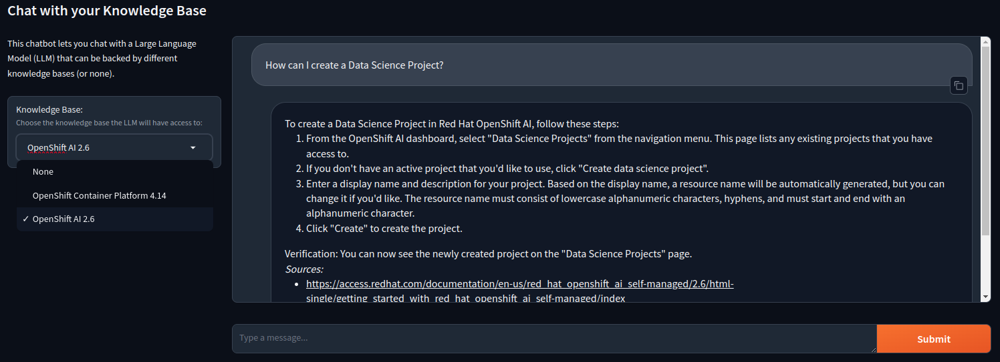

# Gradio UI for RAG using vLLM Inference server and Milvus

This is a simple UI example for a RAG-based Chatbot using Gradio, vLLM Inference server, and Milvus as a vector database.

You can refer to those different notebooks to get a better understanding of the flow:

- [Data Ingestion to Milvus with Langchain](../../../notebooks/langchain/Langchain-Milvus-Ingest.ipynb)
- [Milvus querying with Langchain](../../../notebooks/langchain/Langchain-Milvus-Query.ipynb)
- [Full RAG example with Milvus, vLLM and Langchain](../../../notebooks/langchain/RAG_with_sources_Langchain-vLLM-Milvus.ipynb)

## Requirements

- A vLLM Inference server with a deployed LLM. This example is based on Mistral-7B-Instruct-v0.2 but depending on your LLM you may need to adapt the prompt.
- A Milvus installation. See [here](../../../../vector-databases/milvus/README.md) for deployment instructions.
- A Database and a Collection already populated with documents. See [here](../../../notebooks/langchain/Langchain-Milvus-Ingest.ipynb) for an example.

## Deployment on OpenShift

A pre-built container image of the application is available at: `quay.io/rh-aiservices-bu/gradio-rag-milvus-vllm-openai:latest`

In the `deployment` folder, you will find the files necessary to deploy the application:

- `configmap-collections.yaml`: this ConfigMap holds the configuration for the various Milvus collections you may want to use to back your RAG. Adapt depending on the collections you have created.
- `configmap-prompt.yaml`: This ConfigMap holds the text of the prompt that will be used to query the LLM.
- `deployment.yaml`: you must provide the various information about your inference server and vector database starting at line 52. Please feel free to modify those parameters as you see fit (see parameters below).
- `service.yaml`: creates the Service needed to access the Pod that will be created.
- `route.yaml`: Route definition to expose the Service outside of the cluster. BEWARE: don't forget to protect this Route if you don't want anyone to access your knoledge bases or the LLM.

The different parameters you can/must pass as environment variables in the deployment are:

- APP_TITLE: The tile that will be displayed at the top of the page. Optional, defaults to 'Chat with your Knowledge Base'
- SHOW_TITLE_IMAGE: Displays a small image on the left of the title - Optional, defaults to True
- INFERENCE_SERVER_URL: Inference endpoint (must be vLLM OpenAI Compatible API) - Mandatory
- MODEL_NAME: Name of the served model - Mandatory
- MAX_TOKENS: Maximum number of new tokens that will be generated. Optional, defaults to 512
- TOP_P: Portion of the highest probability tokens to select from by the LLM. Optional, defaults to 0.95
- TEMPERATURE: Affects the probability of generated tokens (the higher, the more "creative"). Optional, defaults to 0.01
- PRESENCE_PENALTY: Tries to reduce token repetition. Optional, defaults to 1.03
- MILVUS_HOST: Hostname of the Milvus database. Mandatory
- MILVUS_PORT: Port of the Milvus database. Mandatory
- MILVUS_USERNAME: Username to connect to the Milvus database. Mandatory
- MILVUS_PASSWORD: Password to connect to the Milvus database. Mandatory
- MILVUS_COLLECTIONS_FILE: File where the available collections are stored (normally a mounted ConfigMap). Mandatory
- DEFAULT_COLLECTION: Name of the default collection to use. Optional, defaults to "none".
- PROMPT_FILE: File where the Prompt is stored (normally a mounted ConfigMap). Mandatory
- MAX_RETRIEVED_DOCS: Maximum number of documents returned by the search. Optional, defaults to 4
- SCORE_THRESHOLD: Maximum allowed score when retrieving document (the score is a cosine distance, the lesser the better. Optional, defaults to 0.99

The deployment replicas is set to 0 initially to let you properly fill in those parameters. Don't forget to scale it up if you want see something 😉!
